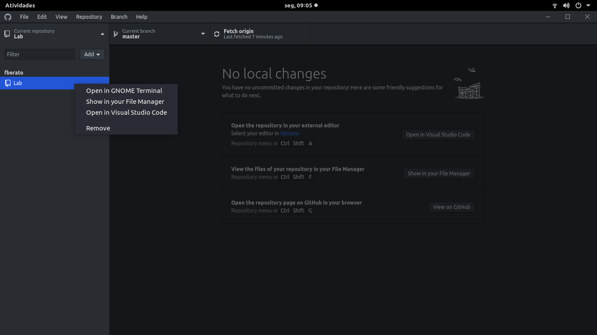
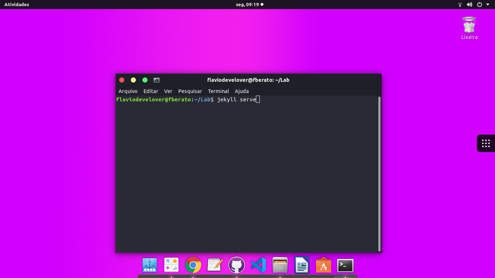
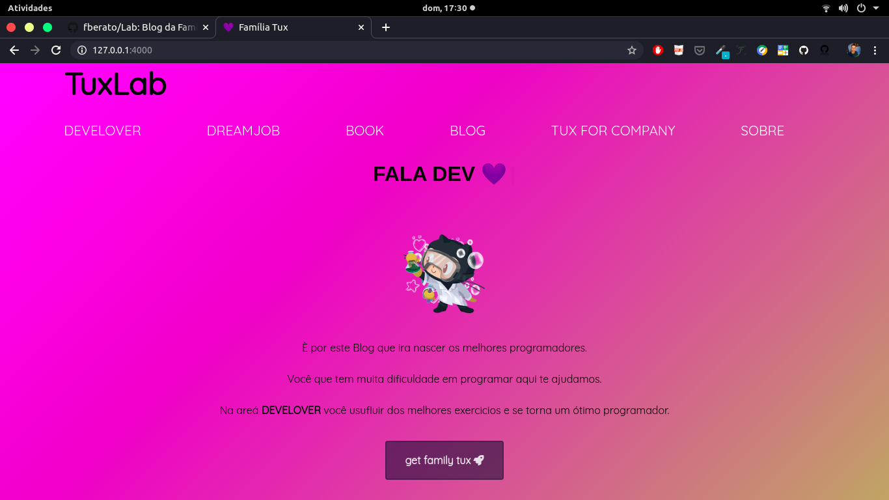
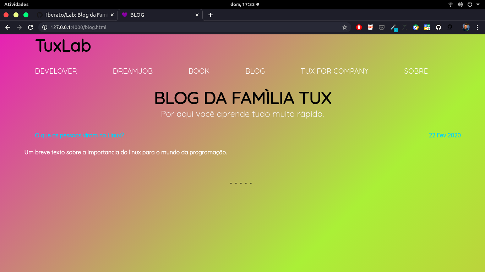
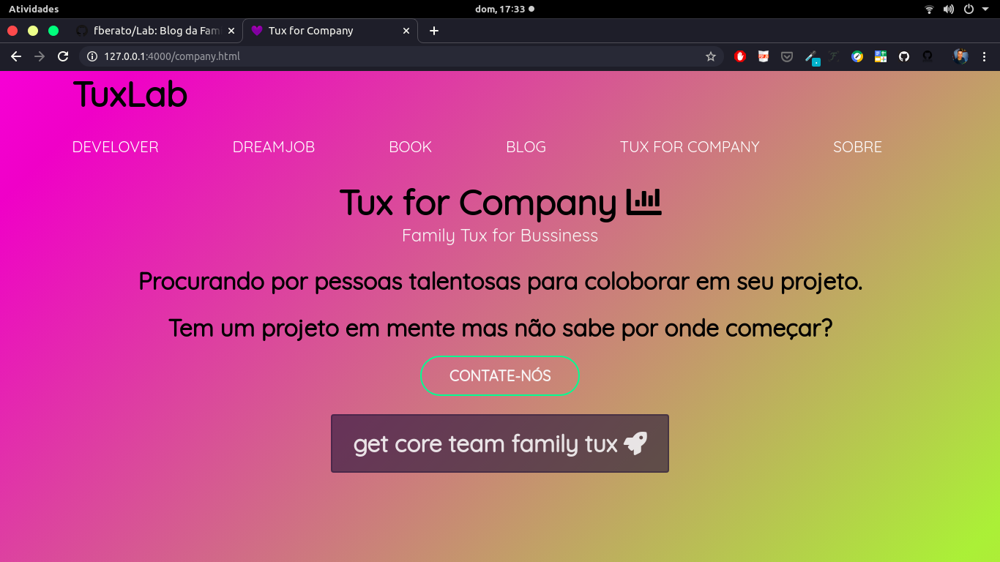
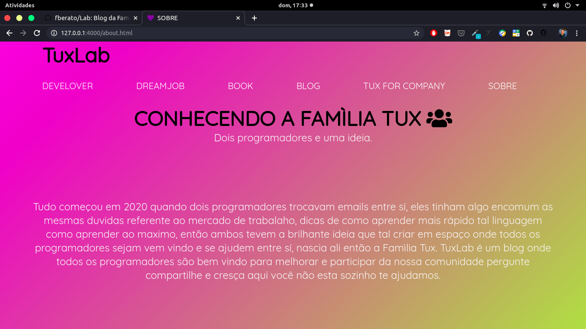

# DOCUMENTAÇÃO BLOG OF FAMILY TUX

 
 # RUN JEKYLL / CONTRIBUA
   
    
    • git clone https://github.com/fberato/Lab.git
    • cd Lab
    • jekyll server

# Second way of run jekyll 
   • Open in Visual Studio Code

   

  • Open in Visual Studio Code
    
   

  • Open in GNOME Terminal
    
    
    • jekyll server

   

# Home
 - Primeira pagina do nosso Blog sejam todos bem-vindo.
 
 

# Dream Job 
 - Encontre o emprego dos seus sonhos. 
 
 
# Encontre diversos livros
  - Àrea destinada a estudos. 

 
# Blog da Família Tux
  - Por aqui você aprende tudo muito rápido.

 
# Tux Core Team for Business 
  - Nessa área você pode entrar em contato conosco para contratar o nosso time de programadores.

 
# About
  - Aqui você conhece mais sobre a Família Tux como nasceu a nossa ideia.

 

# Credits
 <ul>
  <li>Flavio Liberato</li>
  <li>Erika Lopes</li>
  <li>Otavio Augusto</li>
  <li>Fernanda Noel</li>
  <li>Gabriel</li>
  <li>Jennifer Marques</li>
  <li>Giovani</li>
  
  
  

  

 <ul>
  

 
 <em>Família Tux 2020 ©</em>
# 
